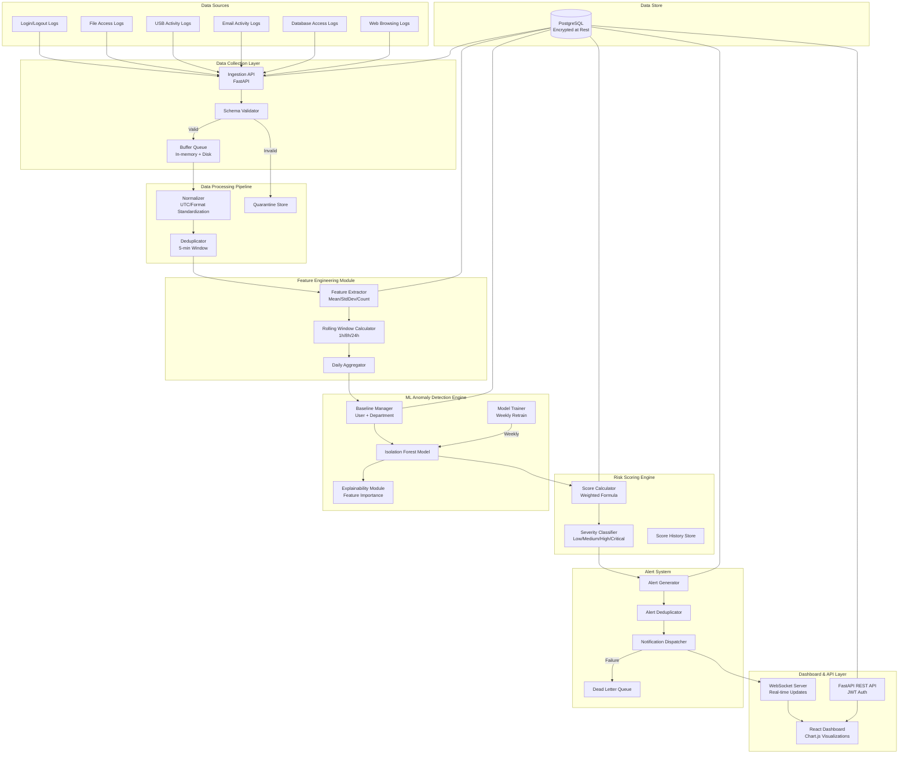
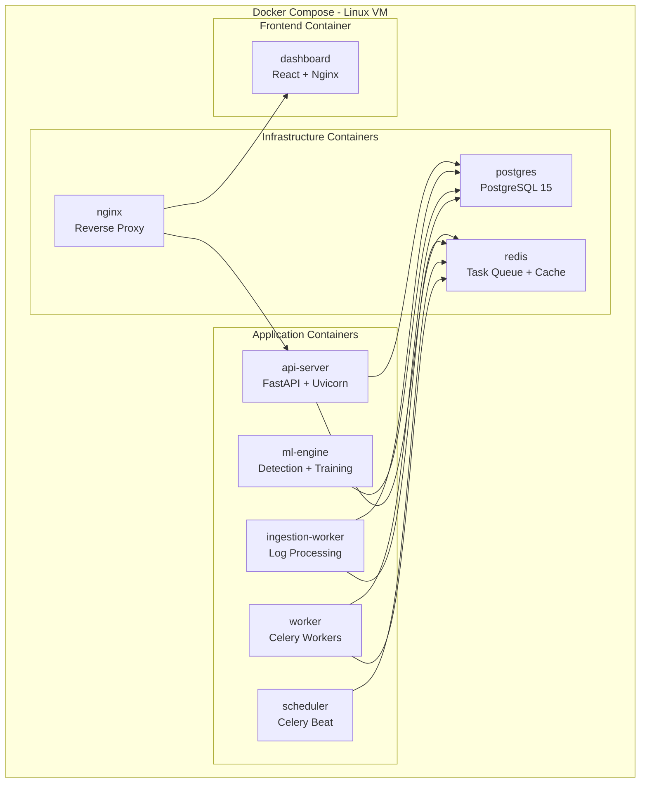
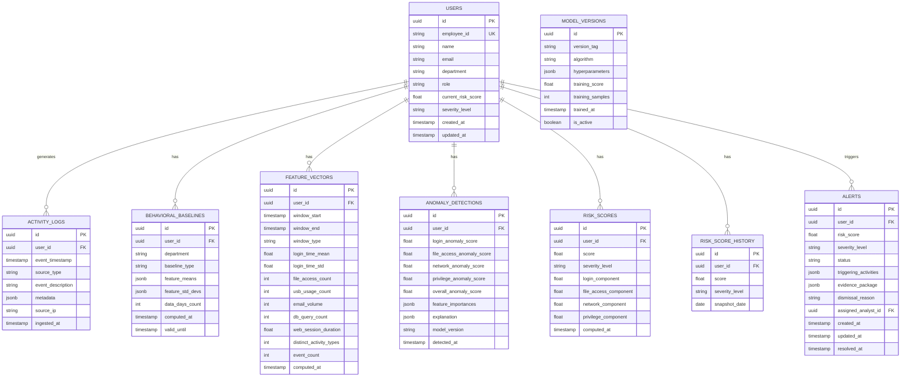

# Design Document: Insider Threat Detection System

## Overview

The Insider Threat Detection System is a security analytics platform that ingests user activity logs from multiple organizational data sources, applies machine learning-based anomaly detection to identify deviations from established behavioral baselines, computes weighted risk scores, and surfaces prioritized alerts to security analysts through a real-time dashboard.

The system follows a pipeline architecture:

```
User Activity Logs → Data Collection Layer → Data Processing Pipeline → Feature Engineering → ML Anomaly Detection Engine → Risk Scoring Engine → Dashboard & Alert System
```

### Key Design Decisions

1. **Isolation Forest as primary ML model**: Chosen for its effectiveness with high-dimensional data, unsupervised nature (no labeled threat data required), and computational efficiency for the 15-minute detection cycle requirement.
2. **FastAPI for the API layer**: Provides async support for high-throughput log ingestion, automatic OpenAPI documentation, and native Pydantic validation for request/response schemas.
3. **PostgreSQL as primary datastore**: Supports complex analytical queries for dashboard aggregations, JSONB for flexible activity log storage, and time-series extensions for trend data.
4. **React + Chart.js for dashboard**: Enables real-time updates via WebSocket, rich interactive visualizations (heatmaps, trend charts), and component-based architecture for the investigation workflow.
5. **Rolling window feature engineering**: Provides temporal context (1h, 8h, 24h windows) that captures behavioral patterns at multiple granularities without requiring excessive storage.

## Architecture

### System Architecture Diagram



### Deployment Architecture



### Key Architectural Patterns

- **Event-driven ingestion**: Activity logs flow through a buffered pipeline with backpressure support
- **Separation of concerns**: Distinct containers for API, ingestion, ML, and scheduling
- **Async processing**: Celery workers handle computationally intensive tasks (model training, baseline computation)
- **Cache-aside pattern**: Redis caches frequently accessed risk scores and dashboard aggregations
- **Circuit breaker**: Database unavailability triggers buffering (5-minute window) before rejecting new records

## Components and Interfaces

### 1. Data Collection Layer

**Responsibility**: Receive, validate, and buffer incoming activity logs from all supported data sources.

**Interface**:
```python
class DataCollectionService:
    async def ingest_log(self, log: ActivityLogInput) -> IngestionResult:
        """Validate and store a single activity log record."""

    async def ingest_batch(self, logs: list[ActivityLogInput]) -> BatchIngestionResult:
        """Validate and store a batch of activity log records."""

    def get_ingestion_metrics(self) -> IngestionMetrics:
        """Return current throughput and buffer status."""
```

**Validation Rules**:
- Mandatory fields: `timestamp`, `user_id`, `source_type`, `event_description`
- Maximum record size: 1 MB
- Supported source types: `login`, `logout`, `file_access`, `usb_activity`, `email`, `database_access`, `web_browsing`

**Buffer Strategy**:
- In-memory buffer with disk spillover
- 5-minute retention during database outage
- Backpressure: HTTP 503 when buffer capacity reached

### 2. Data Processing Pipeline

**Responsibility**: Normalize, deduplicate, and clean raw activity logs for downstream consumption.

**Interface**:
```python
class DataProcessingPipeline:
    async def process_batch(self, records: list[RawActivityLog]) -> ProcessingResult:
        """Normalize, deduplicate, and validate a batch of records."""

    def get_quarantine_stats(self) -> QuarantineStats:
        """Return counts and reasons for quarantined records."""
```

**Processing Steps**:
1. Timestamp normalization → UTC ISO 8601
2. String field normalization → trim + lowercase
3. Deduplication → (user_id, timestamp) within 5-minute lookback
4. Field type validation → reject malformed records
5. Quarantine → isolate records with processing errors

### 3. Feature Engineering Module

**Responsibility**: Compute rolling statistical features from processed activity logs.

**Interface**:
```python
class FeatureEngineeringModule:
    async def compute_rolling_features(self, user_id: str) -> UserFeatures | None:
        """Compute 1h/8h/24h rolling features for a user. Returns None if insufficient data."""

    async def compute_daily_aggregates(self, user_id: str, date: date) -> DailyAggregate:
        """Compute daily behavioral feature aggregates."""

    def get_feature_vector(self, user_id: str) -> FeatureVector | None:
        """Get the latest computed feature vector for ML input."""
```

**Feature Categories**:
- Login time distribution (mean hour, std deviation)
- File access frequency (count per window)
- USB device usage count
- Email volume (sent + received)
- Database query count
- Web browsing session duration
- Distinct activity types per window
- Session duration statistics

**Rolling Windows**: 1-hour, 8-hour, 24-hour with minimum 5 data points per window.

### 4. ML Anomaly Detection Engine

**Responsibility**: Maintain behavioral baselines, detect anomalies using Isolation Forest, and produce explainable results.

**Interface**:
```python
class AnomalyDetectionEngine:
    async def detect_anomalies(self, user_id: str) -> AnomalyResult | None:
        """Run anomaly detection for a user. Returns None if baseline unavailable."""

    async def compute_baseline(self, user_id: str) -> BaselineResult:
        """Compute or update behavioral baseline for a user."""

    async def compute_department_baseline(self, department: str) -> BaselineResult:
        """Compute department-level baseline from all department users."""

    async def retrain_model(self) -> TrainingResult:
        """Retrain Isolation Forest model with latest 90 days of data."""

    def explain_anomaly(self, user_id: str, detection_id: str) -> AnomalyExplanation:
        """Generate plain-language explanation with top contributing factors."""
```

**Model Configuration**:
- Algorithm: Isolation Forest (scikit-learn `IsolationForest`)
- Contamination parameter: 0.05 (configurable)
- Anomaly threshold: 0.65 (configurable, range 0.1–0.95)
- Training data: 90 days rolling window
- Retraining schedule: Weekly
- Detection cycle: Every 15 minutes
- Capacity: Up to 10,000 active users

**Baseline Requirements**:
- Individual baseline: Minimum 30 days of activity data
- Department baseline: Fallback for users with < 30 days
- Update frequency: Every 24 hours

### 5. Risk Scoring Engine

**Responsibility**: Compute weighted risk scores from anomaly detection outputs and maintain score history.

**Interface**:
```python
class RiskScoringEngine:
    def compute_risk_score(self, anomaly_scores: AnomalyScores) -> RiskScoreResult:
        """Compute risk score using weighted formula."""

    async def update_user_score(self, user_id: str, score: RiskScoreResult) -> None:
        """Persist updated risk score and check for rapid change alerts."""

    def classify_severity(self, score: float) -> SeverityLevel:
        """Classify score into Low/Medium/High/Critical."""

    async def get_score_history(self, user_id: str, days: int = 90) -> list[DailyScore]:
        """Retrieve daily score snapshots."""
```

**Scoring Formula**:
```
Risk_Score = 0.3 × Login_Anomaly + 0.3 × File_Access_Anomaly + 0.2 × Network_Activity + 0.2 × Privilege_Usage
```

**Severity Classification**:
- Low: 0–30
- Medium: 31–60
- High: 61–85
- Critical: 86–100

### 6. Alert System

**Responsibility**: Generate, deduplicate, and deliver alerts based on risk score thresholds.

**Interface**:
```python
class AlertSystem:
    async def evaluate_and_alert(self, user_id: str, risk_score: RiskScoreResult) -> Alert | None:
        """Generate or update alert if threshold is met."""

    async def deliver_alert(self, alert: Alert) -> DeliveryResult:
        """Deliver alert to dashboard with retry logic."""

    async def update_alert_status(self, alert_id: str, status: AlertStatus, reason: str = None) -> Alert:
        """Update alert investigation status."""
```

**Alert Lifecycle**:
1. Generated when risk score ≥ 31 (Medium threshold)
2. Deduplicated against existing Open/In Review alerts for same user
3. Delivered to dashboard via WebSocket within 30 seconds
4. Retry: 3 attempts at 10-second intervals on delivery failure
5. Dead letter queue for persistent delivery failures

### 7. API Layer

**Responsibility**: Expose RESTful endpoints for dashboard and external integrations.

**Key Endpoints**:

| Method | Path | Description |
|--------|------|-------------|
| POST | `/api/v1/logs/ingest` | Ingest activity log records |
| POST | `/api/v1/logs/ingest/batch` | Batch ingest activity logs |
| GET | `/api/v1/alerts` | List alerts (paginated, filterable) |
| GET | `/api/v1/alerts/{id}` | Get alert details with evidence |
| PATCH | `/api/v1/alerts/{id}/status` | Update alert status |
| GET | `/api/v1/users/{id}/risk-score` | Get user's current risk score |
| GET | `/api/v1/users/{id}/risk-history` | Get risk score history |
| GET | `/api/v1/users/rankings` | Get users ranked by risk score |
| GET | `/api/v1/dashboard/heatmap` | Get department/time heatmap data |
| GET | `/api/v1/dashboard/department-analytics` | Get department aggregate analytics |
| GET | `/api/v1/users/{id}/activity-summary` | Get user activity summary |
| GET | `/api/v1/users/{id}/explanation/{detection_id}` | Get anomaly explanation |
| POST | `/api/v1/auth/token` | Obtain JWT token |

**Authentication**: JWT tokens with role-based authorization (Security_Analyst, Administrator)
**Pagination**: Default page size 20, max 100
**Performance**: < 500ms at 95th percentile for ≤ 100 concurrent users

### 8. Dashboard (React Frontend)

**Responsibility**: Present real-time alerts, risk rankings, visualizations, and investigation tools.

**Key Views**:
- **Risk Rankings**: Paginated user list sorted by risk score (50 per page)
- **Alert Queue**: Real-time alert feed with status management
- **Investigation Panel**: Evidence package display with timeline, baseline deviations, and explanations
- **Heat Map**: Department × time bucket visualization of risk-triggering events
- **Trend Charts**: 90-day risk score history per user (Chart.js line charts)
- **Department Analytics**: Aggregate risk metrics per department

## Data Models

### Database Schema



### Key Data Types

```python
from enum import Enum
from pydantic import BaseModel, Field
from datetime import datetime, date
from uuid import UUID

class SourceType(str, Enum):
    LOGIN = "login"
    LOGOUT = "logout"
    FILE_ACCESS = "file_access"
    USB_ACTIVITY = "usb_activity"
    EMAIL = "email"
    DATABASE_ACCESS = "database_access"
    WEB_BROWSING = "web_browsing"

class SeverityLevel(str, Enum):
    LOW = "low"
    MEDIUM = "medium"
    HIGH = "high"
    CRITICAL = "critical"

class AlertStatus(str, Enum):
    OPEN = "open"
    IN_REVIEW = "in_review"
    INVESTIGATING = "investigating"
    CONFIRMED_THREAT = "confirmed_threat"
    FALSE_POSITIVE = "false_positive"
    RESOLVED = "resolved"

class WindowType(str, Enum):
    ONE_HOUR = "1h"
    EIGHT_HOUR = "8h"
    TWENTY_FOUR_HOUR = "24h"

class BaselineType(str, Enum):
    INDIVIDUAL = "individual"
    DEPARTMENT = "department"

class ActivityLogInput(BaseModel):
    timestamp: datetime
    user_id: str = Field(min_length=1)
    source_type: SourceType
    event_description: str = Field(min_length=1, max_length=10000)
    metadata: dict | None = None
    source_ip: str | None = None

class AnomalyScores(BaseModel):
    login_anomaly: float = Field(ge=0, le=100)
    file_access_anomaly: float = Field(ge=0, le=100)
    network_activity: float = Field(ge=0, le=100)
    privilege_usage: float = Field(ge=0, le=100)

class RiskScoreResult(BaseModel):
    score: float = Field(ge=0, le=100)
    severity: SeverityLevel
    components: AnomalyScores
    computed_at: datetime

class AnomalyExplanation(BaseModel):
    top_factors: list[ContributingFactor]
    feature_importances: dict[str, float]
    limited_baseline: bool = False

class ContributingFactor(BaseModel):
    feature_name: str
    observed_value: float
    observed_unit: str
    baseline_value: float
    baseline_unit: str
    contribution_weight: float
    limited_data: bool = False
```

### Database Indexes

Key indexes for performance:
- `activity_logs`: Composite index on `(user_id, event_timestamp)` for time-range queries
- `activity_logs`: Index on `source_type` for filtering
- `risk_scores`: Index on `(user_id, computed_at DESC)` for latest score lookup
- `risk_score_history`: Composite index on `(user_id, snapshot_date)` for trend queries
- `alerts`: Index on `(status, severity_level)` for alert queue queries
- `alerts`: Index on `(user_id, status)` for deduplication checks
- `feature_vectors`: Composite index on `(user_id, window_type, window_start)`
- `users`: Index on `(department, current_risk_score DESC)` for department analytics

### Data Retention

- Activity logs: Partitioned by month, retained for 365 days minimum
- Feature vectors: Retained for 90 days (aligned with model training window)
- Risk score history: Daily snapshots retained for 365 days
- Alerts: Retained indefinitely for audit purposes
- Model versions: Retained indefinitely with active flag

## Correctness Properties

*A property is a characteristic or behavior that should hold true across all valid executions of a system — essentially, a formal statement about what the system should do. Properties serve as the bridge between human-readable specifications and machine-verifiable correctness guarantees.*

### Property 1: Activity log validation accepts valid records and rejects invalid records

*For any* activity log record, the Data Collection Layer SHALL accept it if and only if it contains all mandatory fields (timestamp, user_id, source_type, event_description) with correct types and the source_type is one of the supported types, and SHALL reject it otherwise with an error identifying the failing field(s).

**Validates: Requirements 1.1, 1.2, 1.3**

### Property 2: Feature extraction produces all required feature categories

*For any* set of processed activity logs for a user aggregated over a 24-hour period with at least 5 data points, the Feature Engineering Module SHALL produce a feature vector containing all required categories (login time distribution, file access frequency, USB usage count, email volume, database query count, web browsing session duration) with non-null values.

**Validates: Requirements 2.3**

### Property 3: Baseline selection is determined by data availability

*For any* user, the Anomaly Detection Engine SHALL apply the individual baseline if ≥ 30 days of data is available, apply the department baseline if < 30 days of data is available, and if a baseline update fails, the previous baseline SHALL remain unchanged.

**Validates: Requirements 2.4, 2.6**

### Property 4: Anomaly scores are bounded within valid range

*For any* valid feature vector input to the Anomaly Detection Engine, all output anomaly scores SHALL be in the range [0.0, 1.0] for each feature category, and no score shall be NaN or infinite.

**Validates: Requirements 3.1**

### Property 5: Threshold flagging is consistent with anomaly scores

*For any* user's anomaly scores and configured threshold, the user SHALL be flagged as suspicious if and only if at least one feature category score exceeds the threshold; and if fewer than 14 days of data exists with no baseline, scoring SHALL be skipped entirely.

**Validates: Requirements 3.3, 3.6**

### Property 6: Risk score computation follows weighted formula and range

*For any* set of valid anomaly scores (each in [0, 100]), the Risk Scoring Engine SHALL compute the risk score as exactly 0.3 × login_anomaly + 0.3 × file_access_anomaly + 0.2 × network_activity + 0.2 × privilege_usage, producing a result in [0, 100]; and SHALL reject computation if any input score is missing or outside [0, 100], retaining the previous score.

**Validates: Requirements 4.1, 4.5**

### Property 7: Severity classification matches defined ranges

*For any* risk score in [0, 100], the severity classification SHALL be Low for [0, 30], Medium for [31, 60], High for [61, 85], and Critical for [86, 100], with no ambiguity at boundary values.

**Validates: Requirements 4.2**

### Property 8: Rapid score change detection triggers correctly

*For any* sequence of risk score updates for a user within a 24-hour period, a recalculation SHALL be triggered if and only if the absolute difference between any two consecutive scores exceeds 10 points.

**Validates: Requirements 4.3**

### Property 9: Alert generation and deduplication

*For any* user's risk score, an alert SHALL be generated if and only if the score is ≥ 31; and if the user already has an existing alert in Open or In Review status, the existing alert SHALL be updated (not duplicated) with the new score, severity, and triggering evidence.

**Validates: Requirements 5.1, 5.3**

### Property 10: Data normalization produces valid output format

*For any* raw activity log record, the Data Processing Pipeline SHALL produce a normalized record with timestamp in UTC ISO 8601 format, string fields trimmed and lowercased; and for any batch containing duplicate (user_id, timestamp) pairs within a 5-minute window, only the first occurrence SHALL be retained.

**Validates: Requirements 8.1**

### Property 11: Processing pipeline rejects records with missing critical fields

*For any* record where user_id, timestamp, or activity_type is missing or does not conform to its expected data type, the Data Processing Pipeline SHALL reject the record and exclude it from downstream processing.

**Validates: Requirements 8.2**

### Property 12: Rolling statistical features are mathematically correct

*For any* set of N data points (where N ≥ 5) within a rolling window for a user, the Feature Engineering Module SHALL compute mean equal to sum/N, standard deviation equal to the population standard deviation, and count equal to N; and SHALL omit output when N < 5.

**Validates: Requirements 8.3, 8.5**

### Property 13: Error isolation preserves valid record processing

*For any* batch of records where some cause processing errors, the Data Processing Pipeline SHALL successfully process all non-error records and quarantine only the error-causing records, with the count of processed + quarantined equaling the batch size.

**Validates: Requirements 8.4**

### Property 14: Anomaly explanation structure and content

*For any* flagged user, the explanation SHALL contain up to 3 contributing factors (or all available if fewer than 3 exist), where each factor includes the feature name, observed numeric value with unit, and baseline average value with unit; and factors with baseline data < 7 days SHALL be annotated as limited.

**Validates: Requirements 9.1, 9.2, 9.4, 9.5**

### Property 15: Feature importance percentages sum to 100%

*For any* set of feature importance values from the Isolation Forest model, the normalized percentages SHALL sum to 100% (within floating point tolerance of ±0.01%), with each individual percentage being non-negative.

**Validates: Requirements 9.3**

### Property 16: API pagination respects bounds

*For any* pagination request, the API SHALL use page size 20 if not specified, cap page size at 100 if a larger value is requested, and return results consistent with the effective page size (result count ≤ page size).

**Validates: Requirements 10.1**

### Property 17: API authentication and authorization

*For any* API request, the system SHALL return HTTP 401 if the JWT token is missing, malformed, or expired; SHALL return HTTP 403 if the authenticated user's role does not have permission for the requested resource; and SHALL proceed with the request only if both authentication and authorization succeed.

**Validates: Requirements 10.2, 10.3, 10.4**

### Property 18: API input validation returns structured errors

*For any* API request with invalid input parameters, the API SHALL return HTTP 422 with a response body identifying the specific invalid parameter and the validation rule that failed.

**Validates: Requirements 10.6**

### Property 19: User ranking sort order and filtering

*For any* set of users with risk scores and applied filters (department, role, severity, time range), the API SHALL return only users matching all filter criteria, sorted by risk score in descending order, with correct pagination (max 50 per page for dashboard).

**Validates: Requirements 7.1, 7.4**

### Property 20: Heatmap aggregation correctness

*For any* set of risk-triggering events with department and timestamp attributes, the heatmap aggregation SHALL produce counts where the sum of all department-hour bucket counts equals the total number of input events within the configured time range.

**Validates: Requirements 7.3**

### Property 21: Dismissal reason validation

*For any* string provided as a dismissal reason when marking an alert as False Positive, the system SHALL accept it if and only if its length is between 1 and 500 characters inclusive.

**Validates: Requirements 6.4**

## Error Handling

### Data Collection Layer Errors

| Error Condition | Response | Recovery |
|----------------|----------|----------|
| Schema validation failure | Reject record, return 422 with field-level errors | Log to validation_errors table |
| Record size > 1 MB | Reject with 413 Payload Too Large | Caller must reduce payload |
| Database unavailable | Buffer records (5-min max) | Retry at 10s intervals |
| Buffer capacity exceeded | Reject with 503 Service Unavailable | Resume when DB recovers |
| Backpressure triggered | Reject with 429 Too Many Requests | Caller implements exponential backoff |

### Data Processing Pipeline Errors

| Error Condition | Response | Recovery |
|----------------|----------|----------|
| Missing critical fields | Reject record, log reason | Record excluded from pipeline |
| Type mismatch | Reject record, log reason | Record excluded from pipeline |
| Processing exception | Quarantine record | Continue with remaining records |
| Duplicate detected | Discard duplicate silently | First occurrence retained |

### ML Engine Errors

| Error Condition | Response | Recovery |
|----------------|----------|----------|
| Insufficient data (< 14 days) | Skip scoring | Log as pending baseline |
| Baseline unavailable | Use department baseline | Generate if needed |
| Model training failure | Retain previous model | Retry next scheduled window |
| Feature vector incomplete | Skip user for cycle | Retry next cycle |
| Anomaly scores invalid | Reject computation | Retain previous risk score |

### Alert System Errors

| Error Condition | Response | Recovery |
|----------------|----------|----------|
| Dashboard delivery failure | Retry 3x at 10s intervals | Dead letter queue after exhaustion |
| Evidence data unavailable | Show available sections | Display error per unavailable section |
| Alert creation failure | Log error | Retry in next detection cycle |

### API Layer Errors

| Error Condition | HTTP Code | Response Body |
|----------------|-----------|---------------|
| Missing/invalid JWT | 401 | `{"error": "authentication_failed", "detail": "..."}` |
| Insufficient role | 403 | `{"error": "forbidden", "detail": "Required role: ..."}` |
| Invalid parameters | 422 | `{"error": "validation_error", "detail": [{"field": "...", "rule": "..."}]}` |
| Resource not found | 404 | `{"error": "not_found", "detail": "..."}` |
| Internal error | 500 | `{"error": "internal_error", "detail": "..."}` |
| Service unavailable | 503 | `{"error": "service_unavailable", "detail": "...", "retry_after": N}` |

### Global Error Handling Principles

1. **Fail gracefully**: No single record failure should crash the pipeline
2. **Preserve data**: Never silently drop accepted records
3. **Provide context**: All errors include identifiers for tracing
4. **Bounded retries**: All retry mechanisms have explicit limits
5. **Audit trail**: All errors logged with timestamp, component, and context

## Testing Strategy

### Property-Based Testing

**Library**: [Hypothesis](https://hypothesis.readthedocs.io/) (Python PBT framework)

Property-based tests will validate all correctness properties defined above. Each property test runs a minimum of 100 iterations with randomly generated inputs.

**Configuration**:
```python
from hypothesis import settings

@settings(max_examples=100, deadline=None)
```

**Tag format**: Each property test includes a docstring comment:
```python
"""Feature: insider-threat-detection, Property {N}: {property_text}"""
```

**Property tests cover**:
- Risk score computation (Properties 6, 7, 8)
- Activity log validation (Property 1)
- Data normalization and deduplication (Properties 10, 11)
- Rolling feature computation (Property 12)
- Anomaly score bounds (Property 4)
- Threshold flagging logic (Property 5)
- Alert generation/deduplication (Property 9)
- Explanation structure (Properties 14, 15)
- API validation and auth (Properties 16, 17, 18)
- Pagination and sorting (Property 19)
- Aggregation correctness (Property 20)

### Unit Tests

Unit tests complement property tests by covering:
- Specific example scenarios (happy path flows)
- Integration points between components
- Edge cases: empty datasets, boundary values, single-element collections
- Error conditions with specific known inputs
- Serialization/deserialization of data models
- Database query correctness with fixture data

### Integration Tests

- End-to-end ingestion pipeline (log in → stored in DB)
- ML model training and inference with real data samples
- Alert lifecycle (generation → delivery → investigation → resolution)
- WebSocket real-time delivery
- Database failover and buffer recovery
- API endpoint responses with database
- Authentication flow (token obtain → use → refresh → expire)

### Performance Tests

- Ingestion throughput: Sustain 1000 records/second
- Detection cycle: Process 10,000 users within 15 minutes
- API latency: < 500ms at p95 for 100 concurrent users
- Dashboard load: Evidence package within 3 seconds
- Alert delivery: Within 30 seconds of generation

### Test Infrastructure

- **pytest** as test runner
- **Hypothesis** for property-based tests
- **pytest-asyncio** for async test support
- **factory_boy** for test fixture generation
- **testcontainers** for PostgreSQL integration tests
- **httpx** for API endpoint testing
- **locust** for load/performance testing

